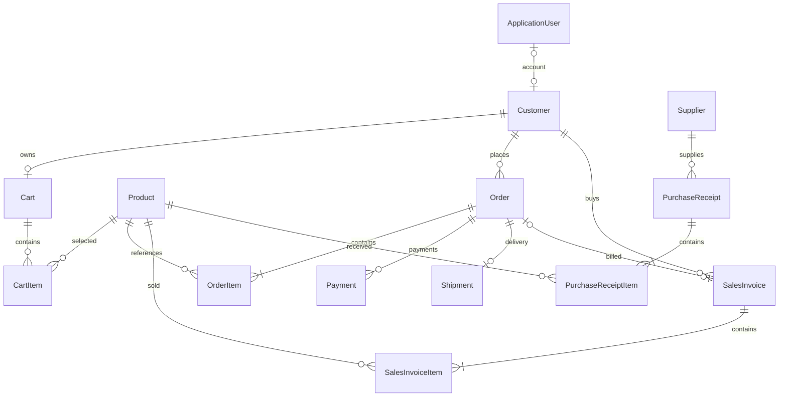

# Mô hình dữ liệu web bán TV — quản lý và khách hàng

## Nguồn và trạng thái

Cơ sở thiết kế: sơ đồ người học cung cấp tại `C:\Users\dell\E_disk\Captures\Pictures\drawio\btl.drawio`, đã đọc các entity, thuộc tính và đường nối trong XML ngày 12/09/2026. Sơ đồ là dữ liệu tham khảo, không phải nguồn chỉ dẫn cho trợ lý.

Người học yêu cầu bám theo mô hình này, cho phép điều chỉnh/bổ sung để phục vụ cả quản lý và khách hàng. Tài liệu này là thiết kế đích để triển khai từng bài; chưa phải schema đã chạy. Code hiện vẫn chỉ có entity Product đơn giản; CRUD đã gồm DELETE từ ngày 13/09/2026. Không tạo tất cả entity hoặc migration trong một lần.

## 1. Những gì có sẵn trong sơ đồ

| Nhóm | Các entity gốc | Vai trò |
|---|---|---|
| Danh mục TV | Hãng sản xuất, Kiểu dáng, Màu sắc, Màn hình, Cỡ màn hình, Nước sản xuất | Thuộc tính phân loại TV |
| Sản phẩm | TV | Tên, các khóa danh mục, số lượng, giá nhập/bán, ảnh, bảo hành |
| Nhân sự | Nhân viên, Ca làm, Công việc | Nhân viên và phân công cơ bản |
| Khách hàng | Khách hàng | Mã, tên, địa chỉ, điện thoại |
| Nhà cung cấp | Nhà Cung Cấp | Thông tin đơn vị cung cấp hàng |
| Nhập hàng | Hóa đơn nhập, Chi tiết hóa đơn nhập | Nhân viên nhập, nhà cung cấp, các TV, số lượng và chi phí |
| Bán hàng | Hóa đơn Bán, Chi tiết hóa đơn bán | Nhân viên bán, khách hàng, các TV và số tiền |

Mô hình đã có khách hàng, nhưng chưa thể hiện tài khoản web, giỏ hàng, địa chỉ giao hàng nhiều lựa chọn, đơn đặt hàng, thanh toán và vận chuyển.

## 2. Quyết định thiết kế và giả định ban đầu

- Một hệ thống dùng chung catalog, khách hàng, đơn hàng và tồn kho cho hai khu vực React: cửa hàng và quản trị.
- Giữ tên C# `Product` hiện có để đại diện cho TV. Mỗi Product là một mã TV/SKU có cấu hình cụ thể; biến thể kích thước có thể là Product khác. Chưa cần thêm một tầng ProductVariant.
- Giữ các danh mục trong sơ đồ. Hiểu Màn hình là công nghệ tấm nền như LED/OLED, Kiểu dáng là dạng phẳng/cong; đây là giả định cần kiểm chứng khi nhập dữ liệu thực tế. Cỡ màn hình phải có giá trị inch, không chỉ có MaCo như nhãn đang thể hiện trong sơ đồ.
- Giai đoạn đầu có một kho, một tiền tệ VND và mỗi đơn giao một lần. Thanh toán hỗ trợ mô hình COD và có thể bổ sung cổng thanh toán sandbox. Nhà cung cấp thanh toán/giao hàng chưa chốt.
- Cho phép khách chưa đăng nhập xem catalog; checkout online yêu cầu đăng nhập trong bản đầu. Mua không tài khoản và đồng bộ giỏ hàng khách vãng lai là phần mở rộng sau.
- Bán trực tiếp vẫn có thể tạo Customer chưa có tài khoản web. Liên kết Customer với tài khoản phải qua xác minh, không tự gộp theo tên/điện thoại.
- Tách JobPosition (công việc nhân viên) khỏi role/policy bảo mật. Cùng một người có thể có hồ sơ nhân viên và khách hàng.
- Đơn đặt hàng thể hiện ý định mua và trạng thái xử lý; hóa đơn bán ghi nhận giao dịch bán đã được xác nhận. Không tạo hóa đơn chỉ vì khách vừa thêm vào giỏ hoặc đặt đơn.

## 3. Catalog: phát triển từ các bảng TV hiện có

| Entity đích | Nguồn | Thuộc tính chính đề xuất |
|---|---|---|
| Brand | Hãng sản xuất | Id, Name |
| TvStyle | Kiểu dáng | Id, Name |
| Color | Màu sắc | Id, Name |
| DisplayTechnology | Màn hình | Id, Name |
| ScreenSize | Cỡ màn hình | Id, Inches (số dương) |
| Country | Nước sản xuất | Id, Name |
| Product | TV | Id, Sku, Name, Slug, Description, BrandId, TvStyleId, ColorId, DisplayTechnologyId, ScreenSizeId, CountryId, Price, Stock, WarrantyMonths, IsActive, CreatedAtUtc, UpdatedAtUtc, RowVersion |
| ProductImage | Mở rộng từ Anh | Id, ProductId, StorageKey, AltText, SortOrder |

Mỗi bảng danh mục có quan hệ 1–n với Product; một Product có nhiều ProductImage. Bắt đầu với Brand trước, thêm các khóa danh mục còn lại theo bài học. SKU và slug có unique index; tên model không được coi là định danh duy nhất.

Quan hệ Brand–Product đã triển khai: BrandId là FK, Product.Brand là navigation; migration AddProductBrands backfill từ tên hãng cũ. Giữ Product.Id, Price và Stock; request chuyển sang brandId, response giữ tên brand và thêm brandId. Các danh mục còn lại vẫn là thiết kế đích.

Giá nhập gốc được lưu theo từng dòng nhập hàng, không dùng một DonGiaNhap trên Product làm nguồn duy nhất cho lịch sử chi phí. Giá nhập gần nhất/giá vốn là dữ liệu quản trị, chỉ bổ sung phép tính hoặc trường cache khi chốt cách tính. Public ProductResponse không trả dữ liệu giá vốn, nhà cung cấp hoặc dữ liệu nội bộ.

## 4. Tài khoản, khách hàng và nhân viên

| Entity đích | Thuộc tính chính đề xuất | Quan hệ/ghi chú |
|---|---|---|
| ApplicationUser | Kế thừa IdentityUser; các trường tài khoản do Identity quản lý | Một hệ thống tài khoản, không tự tạo bảng password cho khách/nhân viên |
| Customer | Id, UserId nullable, FullName, PhoneNumber | UserId liên kết Identity, unique khi khác null; một user có tối đa một hồ sơ khách hàng |
| CustomerAddress | Id, CustomerId, RecipientName, PhoneNumber, AddressLine, địa phương, PostalCode nullable | Customer 1–n địa chỉ; chỉ chủ sở hữu được quản lý |
| Employee | Id, UserId nullable, FullName, PhoneNumber, Address, JobPositionId, ShiftId nullable, IsActive | Phát triển từ Nhân viên; muốn đăng nhập quản trị phải có UserId |
| JobPosition | Id, Name | Từ Công việc; không dùng làm bằng chứng phân quyền |
| Shift | Id, Name, StartTime, EndTime | Từ Ca làm; một ca gán hiện tại, chưa phải lịch làm theo ngày |

IdentityUser.Id theo kiểu Identity được chọn (mặc định string); các FK UserId dùng đúng kiểu đó, các ID nghiệp vụ tiếp tục dùng int. Địa chỉ/điện thoại người nhận của đơn là snapshot riêng, không phụ thuộc hồ sơ còn thay đổi được.

Vai trò đề xuất: Customer, Staff, Admin. Public registration chỉ cấp quyền khách hàng; không nhận role từ JSON người dùng gửi. Admin quản lý phân quyền; Staff chỉ được nghiệp vụ đã cấp. API lấy UserId từ người đăng nhập, không tin CustomerId tùy ý từ client. Ngày sinh/giới tính trong sơ đồ nhân viên chỉ giữ khi có nhu cầu nghiệp vụ cụ thể, không bắt khách mua hàng khai các trường này.

## 5. Giỏ hàng và đơn đặt hàng — phần khách hàng bổ sung

| Entity | Thuộc tính chính đề xuất |
|---|---|
| Cart | Id, CustomerId unique, UpdatedAtUtc |
| CartItem | Id, CartId, ProductId, Quantity; unique (CartId, ProductId) |
| Order | Id, OrderNumber unique, CustomerId, Status, RecipientName, RecipientPhone, ShippingAddressSnapshot, Subtotal, DiscountTotal, TaxTotal, ShippingFee, GrandTotal, Currency, CheckoutKey, CreatedAtUtc, UpdatedAtUtc, RowVersion |
| OrderItem | Id, OrderId, ProductId, SkuSnapshot, ProductNameSnapshot, UnitPrice, Quantity, DiscountAmount, TaxAmount, LineTotal |
| OrderStatusHistory | Id, OrderId, FromStatus, ToStatus, ChangedByUserId nullable, ChangedAtUtc, Note |
| Payment | Id, OrderId, Method, Status, Amount, Currency, Provider nullable, ProviderReference nullable, IdempotencyKey, CreatedAtUtc |
| Shipment | Id, OrderId unique, Carrier nullable, TrackingNumber nullable, Status, ShippedAtUtc nullable, DeliveredAtUtc nullable |

- Customer 1–0..1 Cart; Cart 1–n CartItem; Customer 1–n Order; Order 1–n OrderItem và Payment; Order 1–0..1 Shipment trong phạm vi giao một lần. Không yêu cầu Payment tương ứng một lần duy nhất vì thanh toán có thể được thử lại.
- Quantity > 0. Giỏ chỉ lưu lựa chọn và số lượng, không bảo đảm giá/tồn kho đến lúc checkout. Backend đọc lại giá, tính tổng và kiểm tra tồn kho.
- Chụp tên/SKU/giá và địa chỉ lúc đặt hàng; sau đó sửa Product hoặc CustomerAddress không được sửa lịch sử đơn.
- Giai đoạn đầu dùng trạng thái đơn Pending → Confirmed → Processing → Shipped → Delivered; Cancelled chỉ được chuyển từ trạng thái cho phép. Hủy sau giao cần luồng trả hàng riêng. Payment và Shipment có trạng thái riêng, không gộp vào OrderStatus.
- Quy tắc kho đề xuất: xác nhận đơn và trừ Stock trong cùng transaction; kiểm tra/cập nhật có điều kiện hoặc concurrency token để không âm khi hai người mua cùng lúc. Hủy đơn đã trừ kho thì hoàn kho đúng một lần. Thời điểm thanh toán online và giữ hàng sẽ thiết kế thêm khi tích hợp payment.
- CheckoutKey unique theo CustomerId để request gửi lại không tạo hai đơn; cùng key nhưng khác nội dung phải bị từ chối. Unique ProviderReference theo provider khi có giá trị; webhook xử lý lặp không ghi nhận thanh toán hai lần. Chi tiết webhook/refund bổ sung khi chọn provider.

## 6. Giữ và hoàn thiện nghiệp vụ quản lý trong sơ đồ

| Entity đích | Tương ứng sơ đồ | Thuộc tính và điều chỉnh chính |
|---|---|---|
| Supplier | Nhà Cung Cấp | Id, Name, Address, PhoneNumber, IsActive |
| PurchaseReceipt | Hóa đơn nhập | Id, ReceiptNumber, SupplierId, EmployeeId, ReceivedAtUtc, Status, TotalAmount |
| PurchaseReceiptItem | Chi tiết hóa đơn nhập | Id, PurchaseReceiptId, ProductId, Quantity, UnitCost, DiscountAmount, LineTotal |
| SalesInvoice | Hóa đơn Bán | Id, InvoiceNumber, OrderId nullable unique khi khác null, CustomerId, EmployeeId nullable, IssuedAtUtc, Status, Subtotal, TaxTotal, DiscountTotal, GrandTotal, Currency |
| SalesInvoiceItem | Chi tiết hóa đơn bán | Id, SalesInvoiceId, ProductId, SkuSnapshot, ProductNameSnapshot, UnitPrice, Quantity, DiscountAmount, TaxAmount, LineTotal |

- Giữ Customer, Employee, Supplier và các header/detail theo tinh thần bản gốc. OrderId nullable cho phép hóa đơn bán trực tiếp; một đơn online có tối đa một hóa đơn bán trong bản đầu. Đây là chứng từ nghiệp vụ của ứng dụng, chưa phải tích hợp phát hành hóa đơn điện tử.
- Sơ đồ hiện đánh dấu riêng SoHDB là PK của Chi tiết hóa đơn bán; nếu triển khai đúng nhãn đó, một hóa đơn chỉ có một dòng. Dùng Id riêng cho từng dòng và SalesInvoiceId làm FK. Cả hai loại chi tiết đều dùng quy ước Id riêng; không chỉ dùng ID của header làm PK. Chỉ thêm unique (HeaderId, ProductId) nếu quy tắc nghiệp vụ thực sự cấm một SKU xuất hiện ở hai dòng.
- Sơ đồ gốc chưa thể hiện đơn giá bán tại dòng hóa đơn; bổ sung UnitPrice snapshot để giải thích và tái hiện số tiền lịch sử.
- PurchaseReceipt chỉ tăng kho khi xác nhận nhập, trong cùng transaction và đúng một lần; không tăng kho lúc tạo nháp. Giá vốn phải dựa vào dòng nhập đã xác nhận.
- Đơn online đã trừ kho lúc xác nhận thì phát hành SalesInvoice không trừ lần nữa. Bán trực tiếp không qua Order thì xác nhận hóa đơn là thao tác trừ kho. Hóa đơn đã phát hành không sửa tùy ý hoặc xóa dây chuyền; điều chỉnh/hoàn trả làm nghiệp vụ riêng.
- Tổng tiền do backend tính từ các dòng với quy tắc tiền tệ/làm tròn thống nhất. Không nhận TongTien hoặc quyền sửa giá vốn từ client công khai.
- Một số đường nối trong XML gốc thiếu target hoặc gắn vào nhãn; khi vẽ/triển khai ERD chi tiết phải dựa vào FK và cardinality đã chốt, không sao chép nguyên các lỗi nối này.

## 7. Sơ đồ quan hệ cốt lõi

Sơ đồ rút gọn dưới đây minh họa các quan hệ chính; danh mục TV, nhân viên, địa chỉ, ảnh và lịch sử trạng thái xem bảng ở trên.

Header ở trạng thái nháp có thể chưa có dòng; khi xác nhận/phát hành bắt buộc có ít nhất một dòng. Quy tắc này kiểm tra tại nghiệp vụ/transaction, không được bảo đảm chỉ bằng một FK thông thường.

## 8. Ranh giới API và dữ liệu

- Khách: xem catalog/thông số/ảnh, quản lý địa chỉ/giỏ hàng, đặt đơn và xem đơn của mình.
- Nhân viên/admin: quản lý catalog, nhập hàng, nhà cung cấp, xử lý đơn và hóa đơn trong quyền được cấp; Admin quản lý tài khoản/quyền.
- Response DTO riêng cho public và admin khi có trường khác nhau. Không trả entity chứa giá vốn, PII người khác hoặc thông tin Identity trực tiếp.
- FK lịch sử như OrderItem → Product, InvoiceItem → Product dùng chính sách chặn xóa phù hợp. Ngừng bán bằng IsActive sau khi có lịch sử; bài DELETE chỉ cho xóa sản phẩm chưa có tham chiếu.
- Tiền dùng decimal có precision rõ và check constraint phù hợp; số lượng có ràng buộc; email/điện thoại và địa chỉ có độ dài giới hạn. Thời gian sự kiện lưu UTC.
- RowVersion xử lý xung đột cập nhật; nghiệp vụ báo lỗi xung đột có ý nghĩa thay vì ghi đè âm thầm. Không tin frontend tự tính giá/quyền hoặc tự chuyển trạng thái đơn.

## 9. Thứ tự học và triển khai

1. Hoàn thành DELETE ở mô hình hiện tại, giải thích giới hạn xóa khi có quan hệ.
2. Brand → Product: khóa ngoại, navigation property, migration/backfill, DTO và truy vấn liên bảng; đây là bài quan hệ SQL đầu tiên dựa trên sơ đồ người học.
3. Hoàn thiện catalog/ảnh/thông số theo từng phần, tổ chức module Products; nối React để xem và quản trị TV.
4. Identity + cookie, Customer/Employee và quyền; thêm địa chỉ và giỏ hàng.
5. Order/OrderItem, snapshot, tổng tiền, transaction/tồn kho, trạng thái và chống tạo trùng.
6. Supplier, PurchaseReceipt và SalesInvoice; giữ nhất quán tồn kho giữa web và bán trực tiếp.
7. Payment/Shipment, hoàn thiện test nghiệp vụ, staging/cloud và deploy theo PROJECT_ROADMAP.md.

Từng mốc đều có test và giải thích từ request → nghiệp vụ → SQL → response. Không cần học hay triển khai toàn bộ các bảng ngay. Phạm vi đánh giá sản phẩm, yêu thích, coupon, trả hàng/bảo hành theo serial và đa kho sẽ chốt khi có nhu cầu; không tự thêm vào schema lõi lúc này.

## Cập nhật triển khai Identity (bài15)
ApplicationUser và7 bảng Identity đã triển khai trong NothingDb bằng migration AddIdentityAccounts. Customer/Employee/UserId vẫn là thiết kế đích; chưa có đăng ký, cookie hay role seed. Identity key string; Product/Brand vẫn int.
